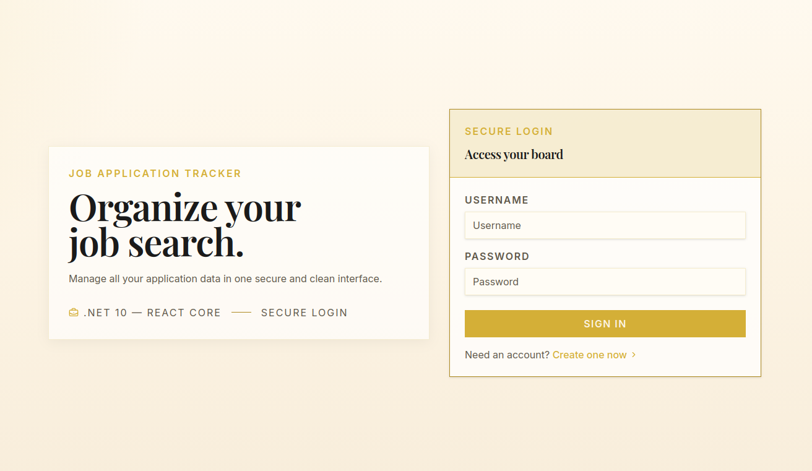
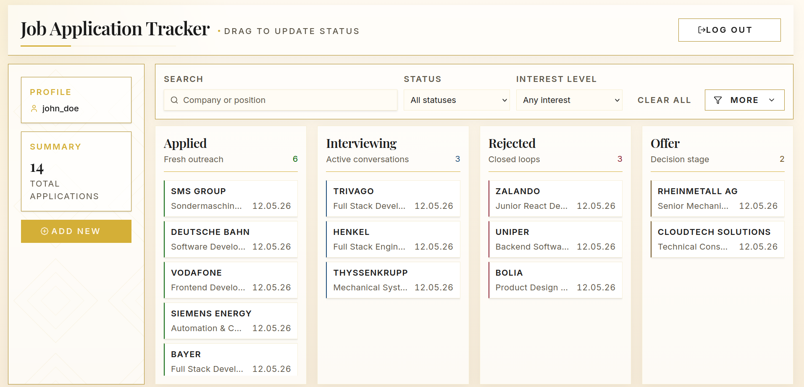
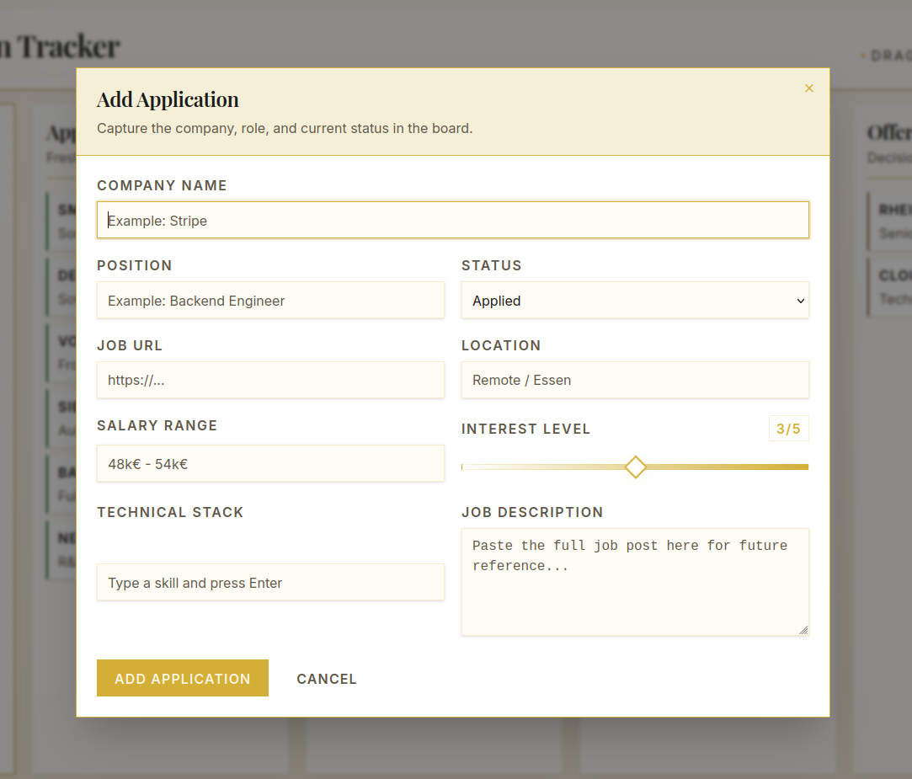
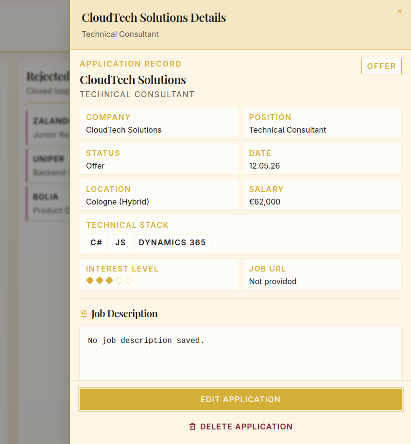

# Job Application Tracker 

Job Application Tracker is a full-stack app for managing job applications with JWT authentication, per-user data isolation, and a compact React dashboard for day-to-day tracking.

The app supports status tracking, detailed application records, drag-and-drop updates, and clear error handling across both the API and client. The current test suite includes 65 automated tests across the backend and frontend.

## Screenshots

The main UI flow is shown below.






## Core Features

- JWT-based register and login flows
- Per-user job application data
- CRUD operations for job applications
- Kanban status tracking for `Applied`, `Interviewing`, `Rejected`, and `Offer`
- Optional application details, including job URL, location, salary range, job description, interest level, and technical stack
- Protected dashboard routes with persisted login state
- Error handling for validation, authorization, server, and connection failures
- OpenAPI artifact and TypeScript client support for keeping the backend and frontend contract visible

## Tech Stack

### Backend

- .NET 10
- ASP.NET Core Web API
- Entity Framework Core
- PostgreSQL with Npgsql
- xUnit
- Moq
- FluentAssertions

### Frontend

- React
- TypeScript
- Vite
- Tailwind CSS
- Vitest
- React Testing Library
- MSW

## Testing

The project uses focused tests at both layers instead of relying on a live external system during normal verification.

- Backend tests cover services, controllers, validation, authentication behavior, and persistence rules using an in-memory EF Core test database and targeted mocks.
- Frontend tests use MSW to verify UI behavior without a live backend, including CRUD flows, loading states, empty states, validation, failed requests, and auth-expiry behavior.

Current test count:

- Backend: `48` tests
- Frontend: `17` tests
- Total: `65` tests

Run the suites with:

```bash
dotnet test server/server.slnx
```

```bash
cd client
npm test
```

## Setup Guide

### Backend

Provide the required API configuration:

- `ConnectionStrings__DefaultConnection`
- `JWT__Issuer`
- `JWT__Audience`
- `JWT__SigningKey`

Restore and run the API:

```bash
dotnet restore server/server.slnx
dotnet run --project server/api
```

The API runs on `http://localhost:5075` by default.

### Frontend

Install dependencies:

```bash
cd client
npm install
```

Start the client:

```bash
npm run dev
```

The frontend expects the API at `http://localhost:5075` unless `VITE_API_BASE_URL` is provided.

## Project Status

The core backend and frontend flows are implemented and tested. Current work is focused on UI/UX refinement and improving the application detail experience.
